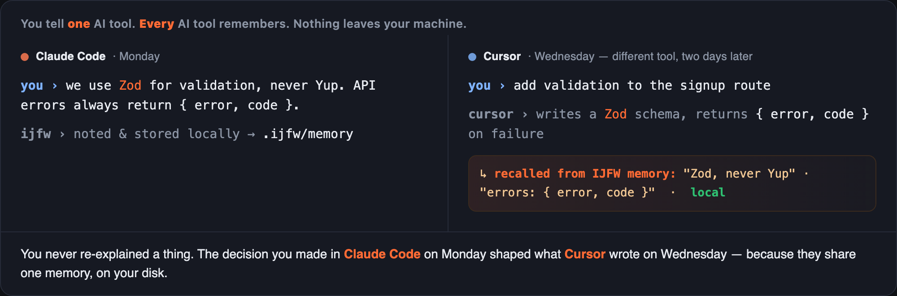
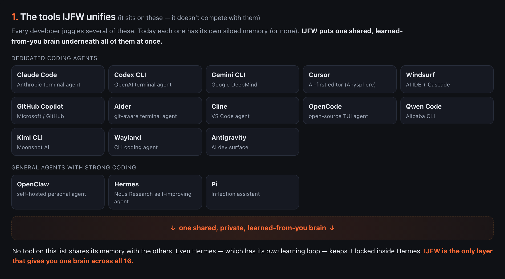

[](https://mseep.ai/app/ferroxlabs-ijfw)

<p align="center">
  
</p>

<p align="center">
  <a href="https://github.com/FerroxLabs/ijfw/actions/workflows/ci.yml"></a>
  <a href="https://www.npmjs.com/package/@ijfw/install"></a>
  <a href="LICENSE"></a>
</p>

## Your AI tools are brilliant, forgetful, undisciplined, and alone. One install fixes all four.

**IJFW is one shared brain, and a full operating layer, for every AI coding tool you use.** Install it once and your tools remember across sessions, plan before they build, check each other's work for hallucinations, pull in the right specialist for the job, and quietly cut your token bill. All on your machine. All yours.

```bash
npm install -g @ijfw/install && ijfw-install
```

<p align="center">
  
</p>

<p align="center"><sub>You told Claude Code once, on Monday. Cursor knew on Wednesday. That's <i>one</i> of the engines.</sub></p>

> **The receipts:** in an open, honest re-run of the field, memory beat no-memory by **+55 points** on LongMemEval. On recalling *when* something happened, Mem0, Letta, and Zep scored **0.000**. IJFW scored **0.676**. [See the benchmark, method, and where we lose &rarr;](docs/benchmarks.md)

---

## Everything it does

One install, one shared brain, and a full engine room around it. Skim the headlines and the bullets. Click into any engine to go deeper.

###  Memory that evolves with you

Your AI stops forgetting. Decisions, context, and the *why* behind them survive across sessions and across tools, and IJFW keeps the store clean on its own.

<p align="center"></p>

- Your decisions, project state, and observations persist as plain markdown under `.ijfw/memory/`, so context survives across sessions instead of evaporating.
- Recall ranks by keyword match with recency decay, so "what did we decide last" returns the latest call, not a random old one.
- A dream cycle promotes proven patterns, supersedes contradictions, and prunes stale notes, so your memory grows sharper over time instead of becoming a junk drawer.
- Bi-temporal facts carry validity windows, letting you ask what was true at a past point, not just what is true now.
- Every connected agent reads the same memory, so a decision recorded in one tool is recallable from another.
- Patterns only graduate to durable knowledge after three references across two sessions, so recall reflects settled facts, not transient remarks.

**[Read more: how memory works &rarr;](docs/memory.md)**

###  Build discipline that holds

The spine that stops AI coding from falling apart mid-session. It plans before it builds and gates every phase behind your sign-off.

- A brainstorm, plan, execute, verify, ship spine makes the plan exist and get signed off before a single line of code, so scope drift dies early.
- Quick mode runs five moves in a few minutes; Deep mode runs six modules for launches, so the ceremony matches the stakes.
- Phase gates are user-facing checklists with no auto-advance, so EXECUTE never rolls into VERIFY behind your back.
- The SHAPE step proposes three approaches, so you start from options to react to instead of a blank page.
- CONVERGE emits an explicit Wave Table marking each wave parallel or sequential, so agent dispatch is deterministic, not re-inferred from prose.
- Every artifact is summarized in chat before it hits disk, so you approve the brief, plan, and waves before they are written.

**[Read more: the workflow engine &rarr;](docs/judgment.md)**

###  A second and third AI catch the hallucinations

One model will confidently ship a bug. So on demand, three models from three different labs red-team the same work in parallel, before it reaches your repo.

<p align="center"></p>

- Cross-audit puts a second and third training lineage on the same diff in parallel, so one model's confident blind spot does not reach production unchallenged.
- IJFW fingerprints the calling model and excludes it, then picks reviewers from different lineages, so the panel catches errors a single model would wave through.
- Findings come back tagged consensus or contested, so you instantly see which to treat as real and which to weigh yourself.
- It fires automatically as a phase after VERIFY and before SHIP, so a hallucinated change gets a second opinion before you ship it, not after.
- Every run appends a receipt with duration, tokens, and finding counts, so the scrutiny is auditable rather than a claim you take on faith.
- The method admits three models can share a wrong prior, so you read consensus as strong evidence and contested findings as a prompt to think.

**[Read more: multi-AI cross-audit &rarr;](docs/judgment.md)**

###  A bench of specialists, summoned on demand

34 skills and a roster of specialist agents that show up only when the work calls for them, then get out of your context.

- Only a 54-line core skill stays resident; the rest load on a matched trigger and unload when done, so your context window stays lean.
- Triggers are natural language ("plan this feature", "cross-audit this"), so you invoke capability by intent without memorizing commands.
- `ijfw team` reads what you are building and writes a purpose-built bench (architect, security, QA, or world-builder), so the roster fits your actual project.
- Each agent runs on a model matched to its scope (cheap models for reads, the strong model for architecture), so you do not overpay for trivial work.
- IJFW hands the design or test phase to a dedicated skill you already installed, so the tool you paid for gets used where it is strongest.
- Generated agents dispatch automatically when a task matches their role, so the right specialist shows up without you routing it by hand.

**[Read more: skills & specialist teams &rarr;](docs/skills.md)**

###  A token bill that drops every session

Six independent cost levers compound on every turn, so your quality goes up while your bill goes down.

- Six levers compound per turn (cache, routing, output discipline, hot-load, sandbox, recall), so savings come from architecture, not a clever prompt.
- Smart routing sends reads to a cheap model and architecture to the strong one, so you stop paying premium rates for trivial work.
- Large command output (builds, test suites, log tails) streams to disk and returns a terse summary, so it never floods your context.
- A stable rules-file prefix is cached, so the context you resend every turn is read at roughly a tenth of normal input pricing instead of full read price.
- One memory prelude call replaces the ten-to-twenty-tool grep cascade a cold session would otherwise open with.
- Each turn ends with a one-line token-saved receipt, so the savings are a logged entry you can check, not a marketing figure.

**[Read more: the token economy &rarr;](docs/efficiency.md)**

###  See every session, and the dollars saved

A live, local dashboard across all your AI tools, with a dollar-saved ledger whose every number traces back to your own logs.

<p align="center"></p>

- A local dashboard shows every tool call across Claude, Codex, and Gemini on one timeline, so you see what each session actually touched.
- The cache-savings figure is measured, not modeled: it prices your real cache-read tokens at Anthropic's posted 90 percent cache discount, so it traces straight to your own Claude logs.
- Savings only counts what is defensible: measured cache reads, first-recall memory hits, and HIGH findings your cross-audit caught pre-ship at a conservative five dollars each, with no invented "spend without IJFW" multiplier.
- The whole pipeline is one JSON line per tool call plus a zero-dependency local page, so you can inspect the raw events yourself.
- The server binds to localhost only and returns 403 to external requests, so your session data stays on your machine.
- Tiles with no cost data say so plainly instead of showing a dressed-up zero, so you never mistake "no data" for "no savings".

**[Read more: observability &rarr;](docs/efficiency.md)**

###  It learns *you*

Rewrite its output once and IJFW notices the diff, then stops repeating that mistake across every tool. It learns from your edits, never your private data.

- The correction loop tracks the gap between what the AI proposed and what you shipped, so it learns from your intentional edits, not noisy copy-paste.
- Nothing enters your profile without a verbatim evidence span behind it, so the system under-learns rather than guessing wrong about you.
- A preference stays unconfirmed until corroborated across separate sessions, so one-off edits do not harden into durable rules.
- The goal is narrow and falsifiable, to stop you repeating the same correction, so success is something you can actually observe.
- A correction captured in one agent informs the profile every other agent reads, so you teach the preference once.
- `ijfw personalize off` is an instant kill-switch and `forget` is a hard reset, so you own whether the profile ever rides into a prompt.

**[Read more: personalization &rarr;](docs/personalization.md)**

###  One design contract, every AI on-brand

Drop a `DESIGN.md` in your project and every agent builds to the same colors, type, and rules. No "make it look nice", no cross-tool drift.

<p align="center"></p>

- A single `DESIGN.md` at your project root holds palette, type, and component rules, so every agent builds from the same source of truth.
- Concrete color values and a real type scale replace adjectives like "clean", so two different agents reading the file make the same choices.
- A picker offers a referenced brand, twelve opinionated templates, or a blank-slate brainstorm, so you get a full nine-section contract without writing one.
- The same catalog reaches full-skill, MCP, and rules-only tools, so the platform that authored the file becomes irrelevant afterward.
- The locked contract hands off to a UI specialist skill if you have one installed, so the render starts with your rules pre-loaded.
- Every screen added later inherits the contract automatically, so on-brand consistency holds across sessions without re-prompting.

**[Read more: the design contract &rarr;](docs/design-contract.md)**

###  Works under everything you use

One install configures every AI tool already on your machine and pre-stages the rest, then connects each one through the richest mechanism it supports.

<p align="center"></p>

- One install reaches sixteen AI coding agents in each tool's own config schema, so you wire nothing and write no per-app code.
- A tool connects through the richest mechanism it supports (full plugin, MCP, or rules file), so IJFW meets each one where it actually is.
- Every MCP-capable tool talks to the same memory server, so a decision stored from one agent is readable by all the others.
- Existing MCP entries, model preferences, and trust settings are preserved and every edited config is backed up first, so nothing you set up breaks.
- IJFW only lists a client it verified it injects into, so the table never shows a phantom "supported" badge.
- When a rules-only tool later gains an MCP client, its entry promotes automatically, so you switch tools and the brain comes along.

**[Read more: platforms & how they connect &rarr;](docs/platforms.md)**

###  And all of it is yours

100% local. No account, no server, no phone-home, MIT-licensed. You can read, audit, or delete every byte it keeps about you.

- Your memory and profile live as plain text on your disk with no account and no remote sync, so you can read, diff, or delete any of it by hand.
- Capture and disclosure are separate consents, and injection is off until you opt in, so learning locally never means leaking automatically.
- Every disclosure to a cloud host is appended to a local egress log, so you can answer exactly what any agent has ever seen about you.
- `forget` deletes inferences and purges the egress entries that referenced them, so a deleted fact cannot be resurrected from the audit trail.
- A hard kill switch (`IJFW_PROFILE_KILL`) always wins over every other setting, so you have one panic button across all surfaces.
- Uninstall backs up every file, strips only IJFW's own marker regions, and preserves your memory by default, so nothing is held hostage.

**[Read more: privacy & control &rarr;](docs/privacy.md)**

---

## Quickstart

```bash
npm install -g @ijfw/install && ijfw-install
```

**Windows** (PowerShell 5.1 or 7+):

```powershell
iwr https://raw.githubusercontent.com/FerroxLabs/ijfw/main/installer/src/install.ps1 -OutFile install.ps1; .\install.ps1
```

> **Preflight:** Node 18+, Git, and a bash shell (Git for Windows ships one, no WSL needed).

Then, in any AI tool on your stack:

| Say this | What happens |
|---|---|
| `recall my project` | Drops your AI back into full context: decisions, state, the why behind them. |
| `cross-audit this file` | Three AIs from different labs review it in parallel; findings tagged consensus or contested. |
| `plan this feature` | Opens the workflow (brief, plan, gates) seeded from your current conversation. |
| `ijfw dashboard start` | Opens your live cost and session dashboard in the browser. |
| `ijfw guide` | The full guide in your browser, 90 seconds to your first win. |

<details>
<summary><b>The 16 tools it unifies</b></summary>

**Dedicated coding agents:** Claude Code, Codex CLI, Gemini CLI, Cursor, Windsurf, GitHub Copilot, Aider, Cline, OpenCode, Qwen Code, Kimi CLI, Wayland, Antigravity
**General agents with strong coding:** OpenClaw, Hermes, Pi

No tool on this list shares its memory with the others. IJFW is the layer that gives you one brain across all of them. [Platforms & how they connect &rarr;](docs/platforms.md)

</details>

---

## What this isn't

- **Not a SaaS.** No account, no dashboard to log into, no subscription, no rate limits.
- **Not a wrapper.** It doesn't proxy your AI traffic. When `cross-audit` fires, it goes through *your* CLI or *your* API key.
- **Not a framework.** You don't write code against it. Install once, ignore it for weeks, then say "recall my project" and drop back into context.
- **Not lock-in.** Your memory is markdown in your repo, your receipts are JSON on your disk. Walk away whenever, and your data walks with you.
- **Not magic.** Deterministic bash, Node, and plain markdown. Inspect every byte. Fork it. Diff next month's release.

## Uninstall

```bash
ijfw-install --uninstall   # or: ijfw uninstall
```

Removes IJFW's entries from each tool's config and its files under `~/.ijfw`, backing up every modified file as `.bak.<timestamp>` first. Your other plugins, MCP servers, and per-project trust settings stay untouched.

## FAQ

**Is this just a Claude Code plugin?** No. Claude Code is where it's richest, but the same memory, profile, and engines reach 16 tools via MCP and a rules-file fallback.
**Do I need a specific AI provider?** No. Bring whatever AI accounts you already use; IJFW adds nothing to pay for.
**What does it cost me?** Nothing. It's free and MIT-licensed, and it tends to *lower* your existing token bill.
**Will it slow my sessions down?** No. The hot-path hook runs in milliseconds and skills load only when triggered.
**Can I turn it off?** Any time, per-feature or entirely. Run `ijfw personalize off`, or uninstall and your data comes with you.

---

<p align="center"><sub><b>IJFW. It Just F*cking Works.</b> Built by <a href="https://github.com/FerroxLabs">Ferrox Labs</a>. Smarter, not cheaper. · MIT</sub></p>
